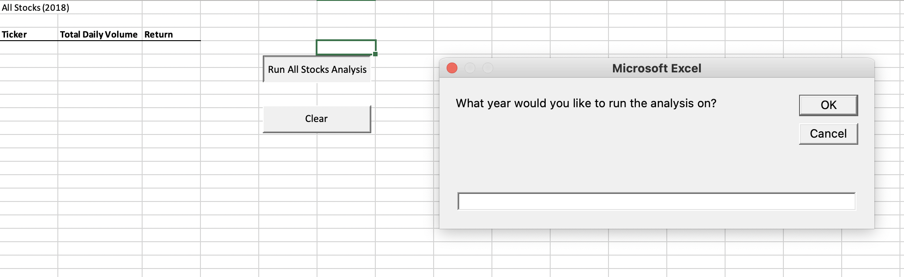
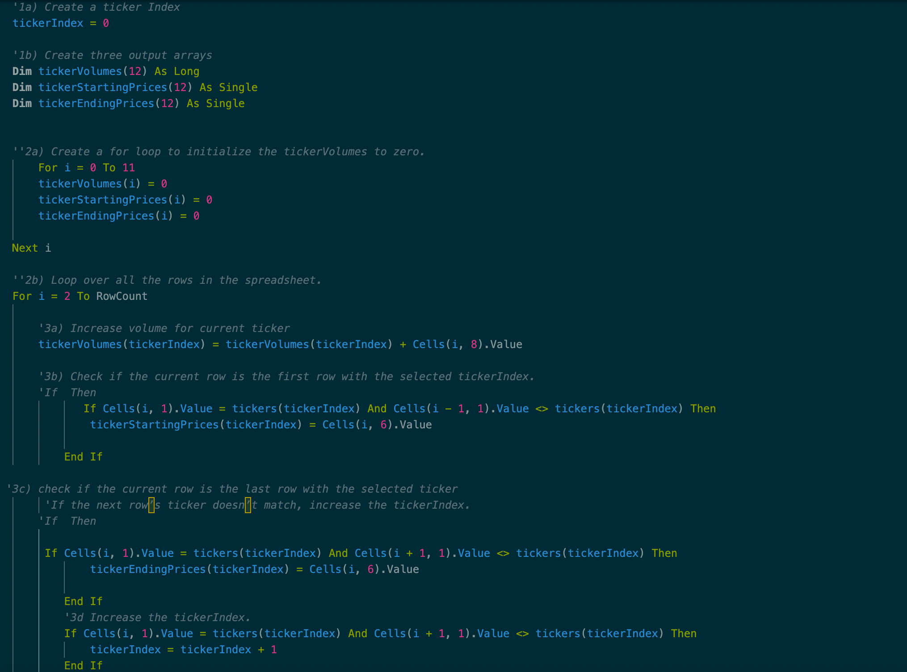
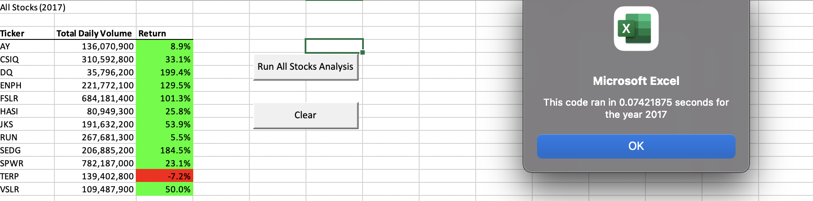
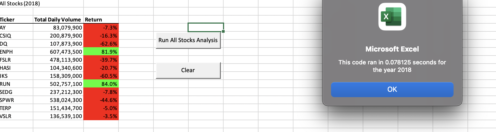

# VBA_Challenge_Stock_Analysis

## Overview

## Purpose

The purpose of this challenge was to refactor, or edit, the VBA code initially used to help Steve understand the risk investment in the provided stock dataset, from 2017 and 2018. The refactored code is similar to that of the initial code, but it was improved to be more efficient. The start and end time for the code to run, had decreased significantly in turn increasing its efficiency. 

## Provided Data and Alterations

The provided datasets include two datasheets with: twelve (12) stock ticker, issued stock date, opening price, highs and lows, closing price, adjusted close price, and volume. The goal is to filter through the data to understand the total volume and return by the ticker. To begin refactoring the code, the initial code was copied into the new sub and an input box was added, the activation of the new worksheets, and the addition of multiple components which is shown below.

## Summary

## Advantages of Refactoring Code

The purpose and advantages of refactoring a code allows one to perfect their code, making it more organized and easier to read. Since the code would be easier to read the ability to make improvements is easier to find the kinks and bugs that hinder the code. The refactored code may also allow not only yourself to read the code with ease, but others. When a person leaves a code, it’s very easy to forget where you left off, but this allows to person reading your code to keep track and follow along with you since the code is clear, concise and to the point. 

## Disadvantages of Refactored Code

A disadvantage of refactoring code may be due to the size of the code., if the code is too large it may be difficult to make it more compact and concise.

## Advantages of Refactored Stock Analysis Code 

